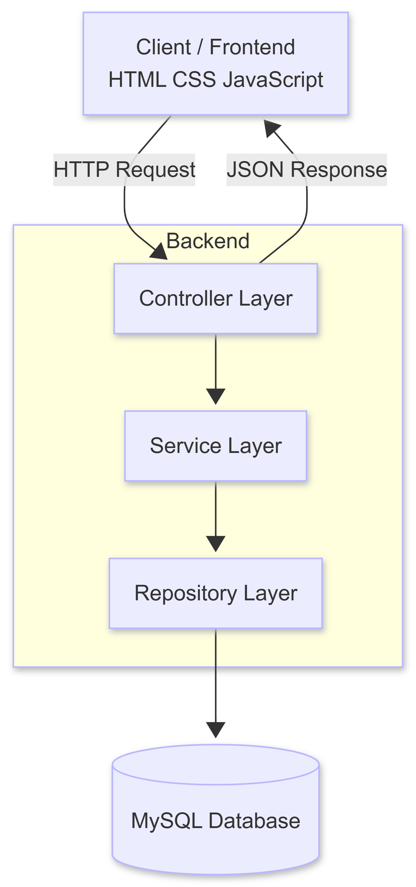
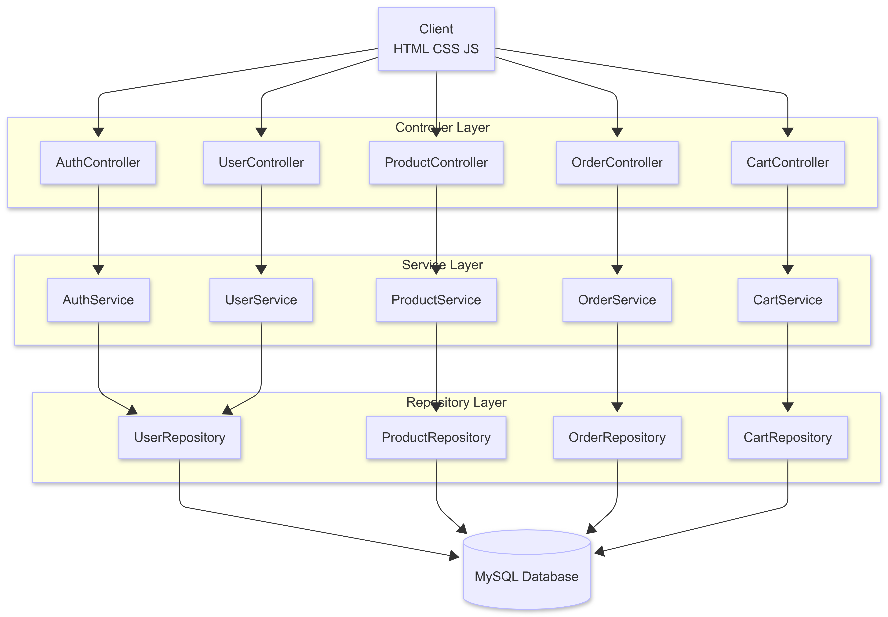
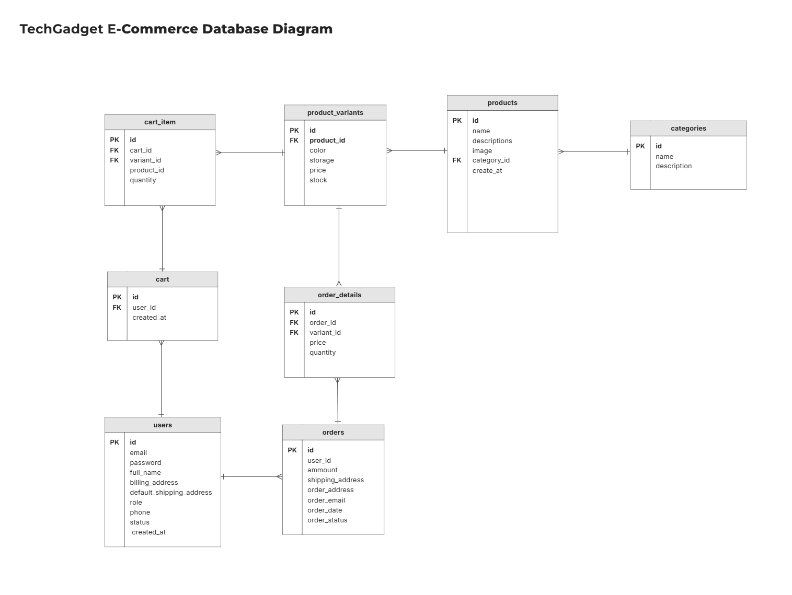
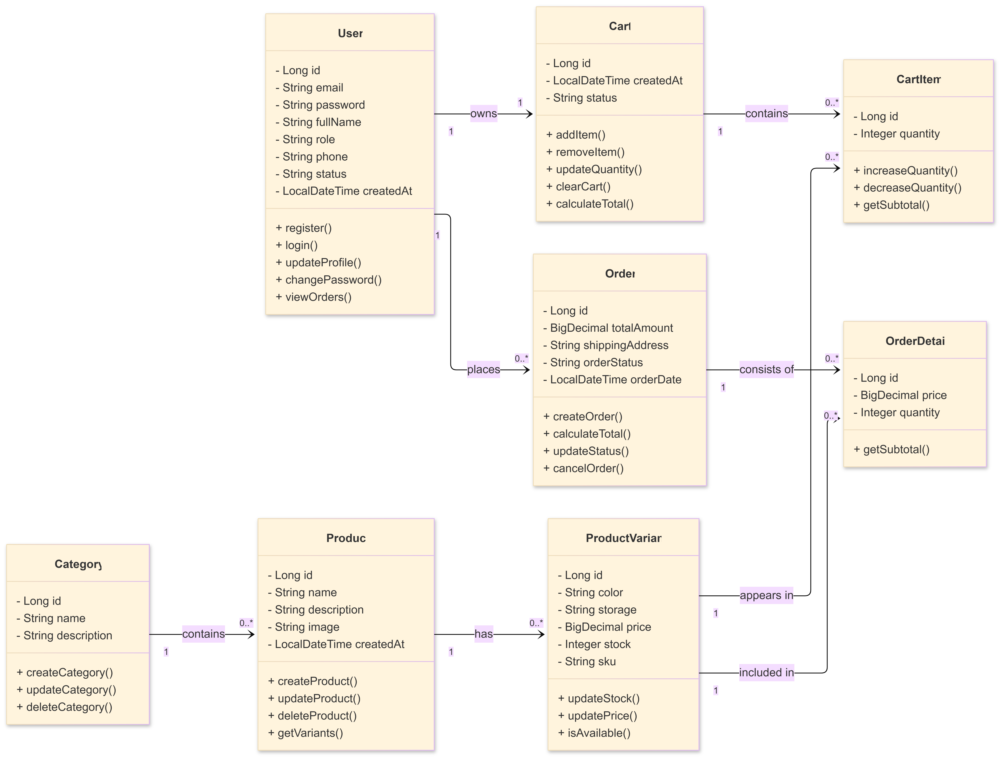
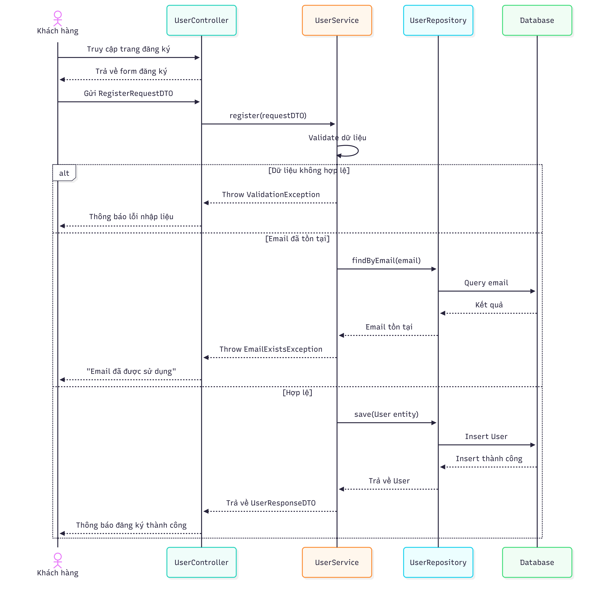
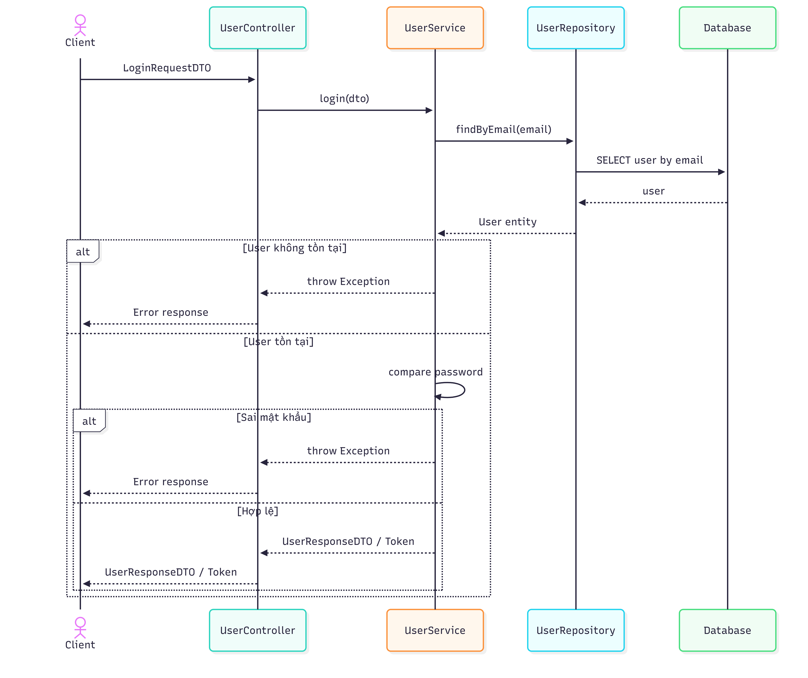
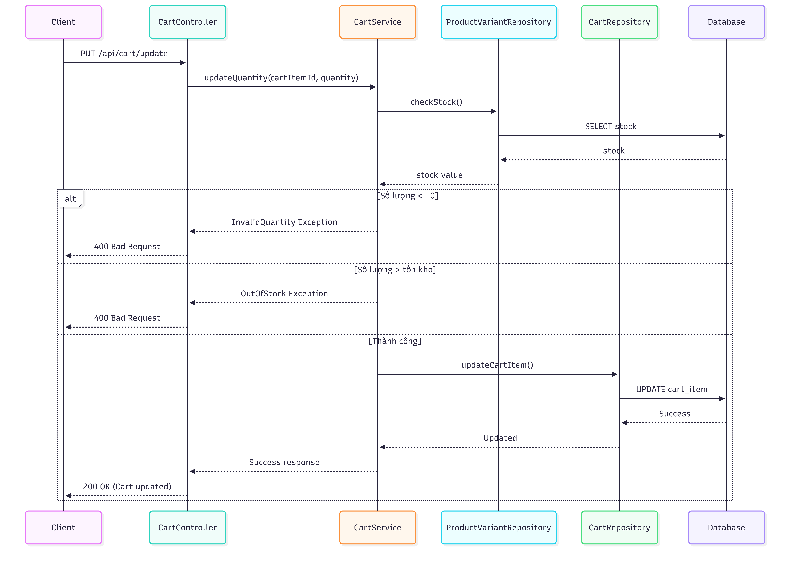
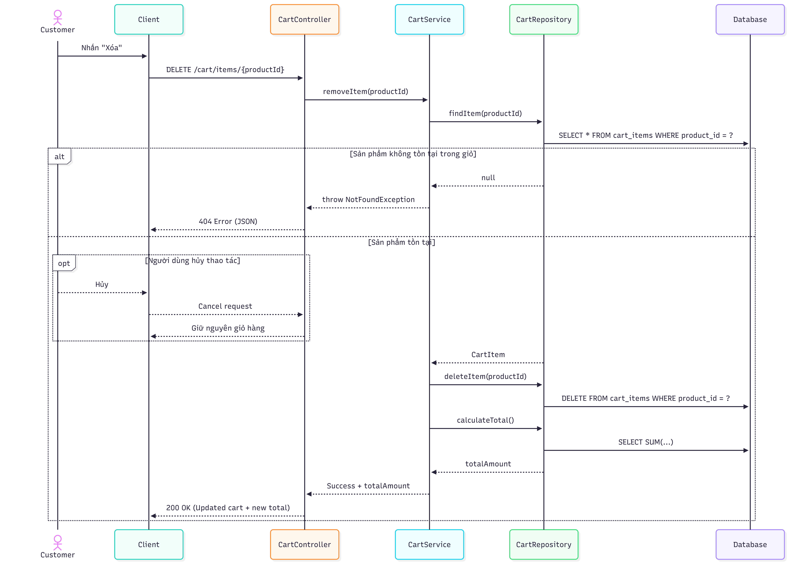

# Software Design Document (SDD)

## Project: TechGadget – E-Commerce System

**Version:** 0.9

**Author:** Đặng Vũ

**Team:** Nhóm 4 - HN25_CPL_OU_05

**Date:** 25/02/2026

---

# Revision History

| Name            | Date       | Reason for Changes                                | Version |
| --------------- | ---------- | ------------------------------------------------- | ------- |
| Đặng Vũ         | 27/02/2026 | Xây dựng cấu trúc tài liệu ban đầu                | 0.1     |
| Đặng Vũ         | 28/02/2026 | Thiết kế kiến trúc tổng thể, lớp và cơ sở dữ liệu | 0.2     |
| Đặng Trung Kiên | 01/03/2026 | Thiết kế và hoàn thiện các sơ đồ tuần tự          | 0.5     |
| Đặng Vũ         | 01/03/2026 | Rà soát tổng thể và hoàn thiện tài liệu           | 0.9     |

---

# 1. Giới thiệu

## 1.1 Mục đích

Tài liệu này mô tả chi tiết thiết kế hệ thống TechGadget E-commerce Platform.

Mục tiêu:

* Mô tả kiến trúc tổng thể hệ thống
* Trình bày thiết kế module và lớp
* Xác định cách các thành phần tương tác
* Làm cơ sở cho triển khai và kiểm thử

## 1.2 Phạm vi

Hệ thống cho phép:

* Đăng ký, đăng nhập
* Xem và tìm kiếm sản phẩm
* Quản lý giỏ hàng
* Đặt và theo dõi đơn hàng
* Quản trị hệ thống

Không bao gồm:

* Hướng dẫn triển khai production
* Tài liệu hướng dẫn người dùng cuối

## 1.3 Định nghĩa và từ viết tắt

| Viết tắt | Nghĩa                             |
| -------- | --------------------------------- |
| SDD      | Software Design Document          |
| UI       | User Interface                    |
| UX       | User Experience                   |
| API      | Application Programming Interface |
| MVC      | Model – View – Controller         |
| CRUD     | Create – Read – Update – Delete   |

## 1.4 Tài liệu tham khảo

[1] SRS Template – GitHub Repository (2018)

---

# 2. Thiết kế tổng thể hệ thống

## 2.1 Kiến trúc hệ thống

Hệ thống sử dụng:

* Layered Architecture
* MVC Pattern




Luồng tổng thể:

```
Client → Controller → Service → Repository → Database
```




Lợi ích:

* Phân tách trách nhiệm rõ ràng
* Dễ bảo trì
* Dễ mở rộng

## 2.2 Chi tiết từng tầng

### Client

* HTML, CSS, JavaScript

### Controller

* Nhận request
* Validate input
* Trả JSON response

### Service

* Xử lý business logic
* Kiểm tra tồn kho
* Tính tổng tiền

### Repository

* Thực hiện CRUD
* Query database

### Database

* MySQL
* Lưu trữ dữ liệu

---

# 3. Thiết kế cơ sở dữ liệu

Hệ thống gồm các bảng chính:

* USERS
* CATEGORIES
* PRODUCTS
* PRODUCT_VARIANTS
* CART
* CART_ITEM
* ORDERS
* ORDER_DETAILS



---

# 4. Thiết kế lớp

Các nhóm lớp:

* Quản lý người dùng
* Quản lý sản phẩm
* Giỏ hàng
* Đơn hàng

Thiết kế đảm bảo:

* Phân tách trách nhiệm
* Giảm phụ thuộc
* Dễ mở rộng



---

# 5. Thiết kế chi tiết

## 5.1 Module Quản lý người dùng

### 5.1.1 Tổng quan

Chức năng:

* Đăng ký
* Đăng nhập
* Cập nhật thông tin
* Phân quyền

### 5.1.2 Sequence – Đăng ký



### 5.1.3 Sequence – Đăng nhập



---

## 5.2 Module Xem và tìm kiếm sản phẩm

### 5.2.1 Tổng quan

Chức năng:

* Hiển thị danh sách
* Xem chi tiết
* Tìm kiếm
* Lọc sản phẩm

### 5.2.2 Sequence – Xem danh sách sản phẩm


### 5.2.3 Sequence – Lọc sản phẩm


### 5.2.4 Sequence – Tìm kiếm sản phẩm


### 5.2.5 Sequence – Xem chi tiết sản phẩm


---

## 5.3 Module Quản lý đơn hàng

### 5.3.1 Tổng quan

Chức năng:

* Tạo đơn hàng
* Cập nhật trạng thái
* Xem lịch sử

### 5.3.2 Sequence – Tạo đơn hàng


### 5.3.3 Sequence – Xem lịch sử đơn hàng


### 5.3.4 Sequence – Theo dõi trạng thái đơn hàng


---

## 5.4 Module Quản lý giỏ hàng

### 5.4.1 Tổng quan

Chức năng:

* Thêm sản phẩm
* Cập nhật số lượng
* Xóa sản phẩm

### 5.4.2 Sequence – Thêm vào giỏ hàng


### 5.4.3 Sequence – Cập nhật số lượng



### 5.4.4 Sequence – Xóa sản phẩm khỏi giỏ hàng



---

## 5.5 Module Quản lý hệ thống

### 5.5.1 Tổng quan

Chức năng:

* Thêm sản phẩm
* Cập nhật sản phẩm
* Quản lý biến thể

### 5.5.2 Sequence – Thêm sản phẩm


### 5.5.3 Sequence – Cập nhật thông tin sản phẩm


---

**Ghi chú:** Sau khi hoàn thiện sơ đồ tuần tự, thay thế các file ảnh trong thư mục `images/` tương ứng.
