# Software Design Document (SDD)

## Project: TechGadget – E-Commerce System

**Version:** 1.1

**Author:** Đặng Vũ

**Team:** Nhóm 4 - HN25_CPL_OU_05

**Date:** 25/02/2026

---

# Revision History

| Name            | Date       | Reason for Changes                                          | Version |
| --------------- | ---------- | ----------------------------------------------------------- | ------- |
| Đặng Vũ         | 27/02/2026 | Xây dựng cấu trúc tài liệu ban đầu                          | 0.1     |
| Đặng Vũ         | 28/02/2026 | Thiết kế kiến trúc tổng thể, lớp và cơ sở dữ liệu           | 0.2     |
| Đặng Trung Kiên | 01/03/2026 | Thiết kế và hoàn thiện các sơ đồ tuần tự                    | 0.5     |
| Đặng Vũ         | 01/03/2026 | Rà soát tổng thể và hoàn thiện tài liệu                     | 0.9     |
| Đặng Trung Kiên | 10/04/2026 | Cập nhật CSDL, module Review và Promotion Popup             | 1.0     |


---

# 1. Giới thiệu

## 1.1 Mục đích

Tài liệu này mô tả chi tiết thiết kế hệ thống TechGadget E-commerce Platform.

Mục tiêu:

* Mô tả kiến trúc tổng thể hệ thống
* Trình bày thiết kế cơ sở dữ liệu và các lớp
* Xác định cách các thành phần tương tác qua sequence diagram
* Làm cơ sở cho triển khai và kiểm thử

## 1.2 Phạm vi

Hệ thống cho phép:

* Đăng ký, đăng nhập (JWT)
* Xem, tìm kiếm và lọc sản phẩm
* Quản lý giỏ hàng
* Đặt hàng và thanh toán (COD / QR PayOS)
* Theo dõi và quản lý đơn hàng
* Đánh giá sản phẩm (Review & Rating)
* Hiển thị popup khuyến mãi
* Quản lý mã giảm giá (Coupon)
* Quản trị hệ thống (Admin)

Không bao gồm:

* Hướng dẫn triển khai production
* Tài liệu hướng dẫn người dùng cuối

## 1.3 Định nghĩa và từ viết tắt

| Viết tắt | Nghĩa                             |
| -------- | --------------------------------- |
| SDD      | Software Design Document          |
| UI       | User Interface                    |
| UX       | User Experience                   |
| API      | Application Programming Interface |
| MVC      | Model – View – Controller         |
| CRUD     | Create – Read – Update – Delete   |
| JWT      | JSON Web Token                    |
| DTO      | Data Transfer Object              |
| ERD      | Entity Relationship Diagram       |
| COD      | Cash on Delivery                  |
| SKU      | Stock Keeping Unit                |
| RBAC     | Role-Based Access Control         |

## 1.4 Tài liệu tham khảo

[1] SRS Template – GitHub Repository (2018)

---

# 2. Thiết kế tổng thể hệ thống

## 2.1 Kiến trúc hệ thống

Hệ thống sử dụng Layered Architecture theo mô hình MVC:

```
Client (Browser) → Controller → Service → Repository → Database (PostgreSQL)
```

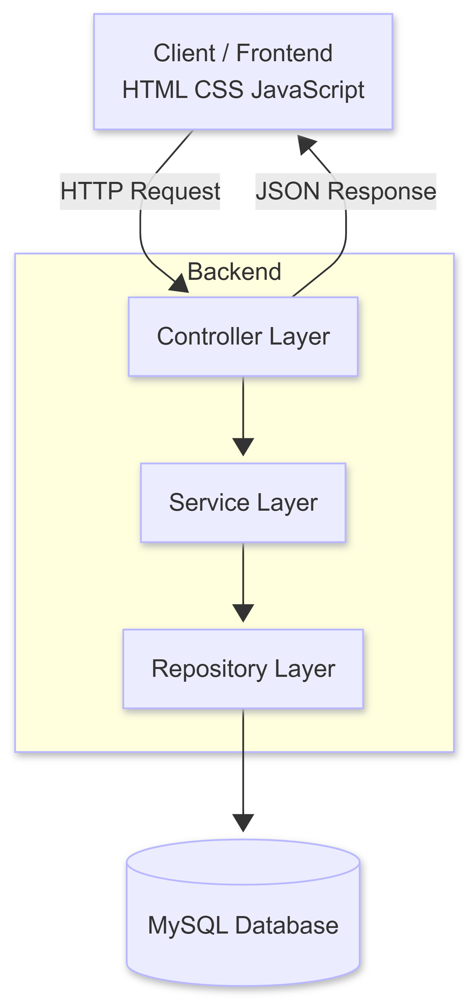

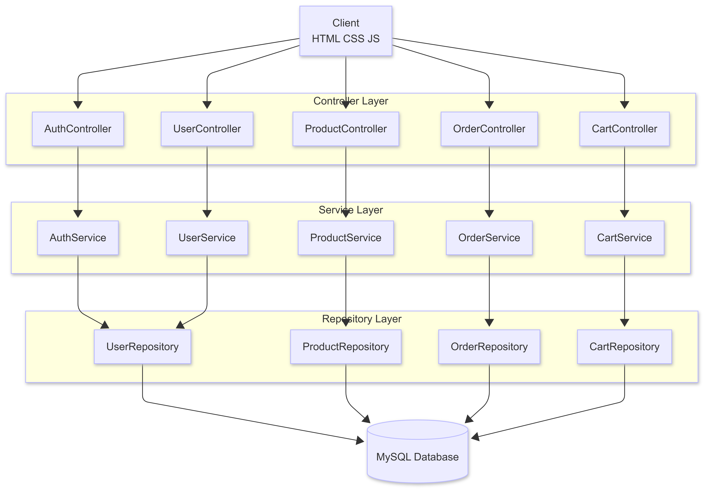

Lợi ích:

* Phân tách trách nhiệm rõ ràng
* Dễ bảo trì và mở rộng
* Dễ kiểm thử từng tầng độc lập

## 2.2 Chi tiết từng tầng

### Client
* HTML, CSS, JavaScript (Vanilla)
* Giao tiếp với backend qua REST API
* Lưu JWT token trong `localStorage`, trạng thái popup trong `sessionStorage`

### Controller
* Nhận HTTP request
* Validate input (Jakarta Validation)
* Gọi Service và trả về `ApiResponse<T>` dạng JSON

### Service
* Xử lý business logic
* Kiểm tra tồn kho, tính giảm giá coupon, xác thực quyền
* Gọi Repository để truy xuất dữ liệu

### Repository
* Kế thừa `JpaRepository`
* Thực hiện CRUD và custom query

### Database
* PostgreSQL
* Lưu trữ toàn bộ dữ liệu hệ thống

## 2.3 Bảo mật

* Xác thực bằng JWT — mỗi request gửi kèm `Authorization: Bearer {token}`
* Phân quyền RBAC với 2 role: `ADMIN` và `CUSTOMER`
* Mật khẩu mã hóa bằng BCrypt
* `JwtFilter` kiểm tra token trước mỗi request được bảo vệ

---

# 3. Thiết kế cơ sở dữ liệu

## 3.1 Danh sách bảng

| Bảng                     | Mô tả                                      |
| ------------------------ | ------------------------------------------ |
| users                    | Tài khoản người dùng                       |
| categories               | Danh mục sản phẩm                          |
| brands                   | Thương hiệu sản phẩm                       |
| attributes               | Thuộc tính sản phẩm (RAM, Storage, ...)    |
| category_attributes      | Quan hệ nhiều-nhiều danh mục – thuộc tính  |
| products                 | Sản phẩm                                   |
| product_variants         | Biến thể sản phẩm (SKU, giá, tồn kho)      |
| variant_attribute_values | Giá trị thuộc tính của từng biến thể       |
| cart                     | Giỏ hàng (1 user – 1 cart)                 |
| cart_item                | Chi tiết sản phẩm trong giỏ hàng           |
| orders                   | Đơn hàng                                   |
| order_details            | Chi tiết sản phẩm trong đơn hàng           |
| coupons                  | Mã giảm giá                                |
| coupon_usages            | Lịch sử sử dụng coupon theo user           |
| reviews                  | Đánh giá sản phẩm                          |
| promotion_popups         | Popup khuyến mãi                           |
| pending_payments         | Trạng thái thanh toán QR đang chờ xử lý   |

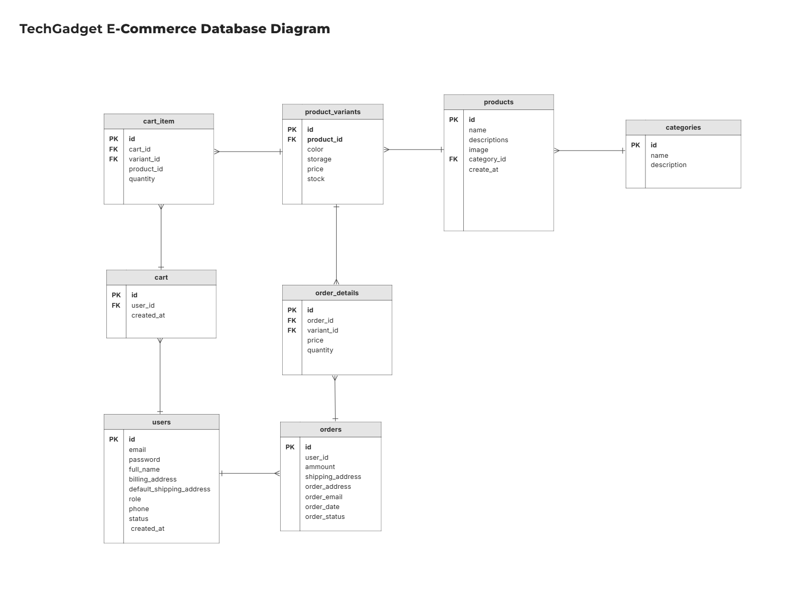

## 3.2 Chi tiết các bảng chính

### Bảng: users

| Cột        | Kiểu        | Ràng buộc              | Mô tả                          |
| ---------- | ----------- | ---------------------- | ------------------------------ |
| id         | BIGINT      | PK, AUTO_INCREMENT     | Khóa chính                     |
| email      | VARCHAR     | NOT NULL, UNIQUE       | Email đăng nhập                |
| password   | VARCHAR     | NOT NULL               | Mật khẩu (BCrypt)              |
| full_name  | VARCHAR     |                        | Họ tên                         |
| role       | VARCHAR     | NOT NULL               | ADMIN / CUSTOMER               |
| created_at | TIMESTAMP   | NOT NULL               | Thời điểm tạo tài khoản        |

### Bảng: products

| Cột         | Kiểu      | Ràng buộc          | Mô tả                    |
| ----------- | --------- | ------------------ | ------------------------ |
| id          | BIGINT    | PK, AUTO_INCREMENT | Khóa chính               |
| name        | VARCHAR   | NOT NULL           | Tên sản phẩm             |
| description | TEXT      |                    | Mô tả                    |
| image       | VARCHAR   |                    | URL ảnh đại diện         |
| total_sold  | INT       | DEFAULT 0          | Tổng số đã bán           |
| created_at  | TIMESTAMP | NOT NULL           | Thời điểm tạo            |
| category_id | BIGINT    | FK → categories    | Danh mục                 |
| brand_id    | BIGINT    | FK → brands        | Thương hiệu              |

### Bảng: product_variants

| Cột            | Kiểu          | Ràng buộc              | Mô tả                        |
| -------------- | ------------- | ---------------------- | ---------------------------- |
| id             | BIGINT        | PK, AUTO_INCREMENT     | Khóa chính                   |
| name           | VARCHAR       |                        | Tên biến thể                 |
| sku            | VARCHAR(50)   | NOT NULL, UNIQUE       | Mã SKU                       |
| price          | DECIMAL(12,2) | NOT NULL               | Giá bán                      |
| stock          | INT           | NOT NULL, DEFAULT 0    | Tồn kho thực tế              |
| reserved_stock | INT           | NOT NULL, DEFAULT 0    | Tồn kho đang giữ chỗ         |
| sold_count     | INT           | DEFAULT 0              | Số lượng đã bán              |
| description    | TEXT          |                        | Mô tả biến thể               |
| product_id     | BIGINT        | FK → products          | Sản phẩm cha                 |

### Bảng: orders

| Cột              | Kiểu          | Ràng buộc          | Mô tả                                                        |
| ---------------- | ------------- | ------------------ | ------------------------------------------------------------ |
| id               | BIGINT        | PK, AUTO_INCREMENT | Khóa chính                                                   |
| amount           | DECIMAL(12,2) |                    | Tổng tiền gốc                                                |
| shipping_address | VARCHAR       |                    | Địa chỉ giao hàng                                            |
| phone_number     | VARCHAR       |                    | Số điện thoại                                                |
| order_email      | VARCHAR       |                    | Email đặt hàng                                               |
| order_date       | TIMESTAMP     |                    | Thời điểm đặt hàng                                           |
| order_status     | VARCHAR       |                    | PENDING / CONFIRMED / PROCESSING / SHIPPING / DELIVERED / CANCELLED / FAILED |
| payment_method   | VARCHAR       |                    | COD / QR                                                     |
| payment_status   | VARCHAR       |                    | PENDING / PAID / FAILED                                      |
| transaction_id   | VARCHAR       |                    | Mã giao dịch PayOS                                           |
| order_code       | BIGINT        |                    | Mã đơn hàng PayOS                                            |
| coupon_code      | VARCHAR       |                    | Mã coupon đã áp dụng                                         |
| discount_amount  | DECIMAL(12,2) |                    | Số tiền được giảm                                            |
| final_amount     | DECIMAL(12,2) |                    | Tổng tiền sau giảm giá                                       |
| user_id          | BIGINT        | FK → users         | Người đặt hàng                                               |

### Bảng: coupons

| Cột                  | Kiểu          | Ràng buộc          | Mô tả                              |
| -------------------- | ------------- | ------------------ | ---------------------------------- |
| id                   | BIGINT        | PK, AUTO_INCREMENT | Khóa chính                         |
| code                 | VARCHAR       | NOT NULL, UNIQUE   | Mã coupon                          |
| type                 | VARCHAR       | NOT NULL           | PERCENT / FIXED                    |
| value                | DECIMAL(12,2) | NOT NULL           | Giá trị giảm                       |
| min_order_amount     | DECIMAL(12,2) |                    | Giá trị đơn hàng tối thiểu         |
| max_discount_amount  | DECIMAL(12,2) |                    | Mức giảm tối đa                    |
| start_at             | TIMESTAMP     |                    | Ngày bắt đầu hiệu lực              |
| end_at               | TIMESTAMP     |                    | Ngày kết thúc hiệu lực             |
| usage_limit          | INT           |                    | Giới hạn tổng lượt dùng            |
| used_count           | INT           |                    | Số lượt đã dùng                    |
| usage_limit_per_user | INT           |                    | Giới hạn lượt dùng mỗi user        |
| is_active            | BOOLEAN       |                    | Trạng thái kích hoạt               |

### Bảng: reviews

| Cột        | Kiểu      | Ràng buộc              | Mô tả                       |
| ---------- | --------- | ---------------------- | --------------------------- |
| id         | BIGINT    | PK, AUTO_INCREMENT     | Khóa chính                  |
| product_id | BIGINT    | NOT NULL, INDEX        | ID sản phẩm được đánh giá   |
| user_id    | BIGINT    | NOT NULL, INDEX        | ID người dùng viết đánh giá |
| rating     | INT       | NOT NULL, INDEX, 1–5   | Số sao đánh giá             |
| comment    | TEXT      | NOT NULL               | Nội dung đánh giá           |
| created_at | TIMESTAMP | NOT NULL               | Thời điểm tạo               |

### Bảng: promotion_popups

| Cột         | Kiểu      | Ràng buộc          | Mô tả                           |
| ----------- | --------- | ------------------ | ------------------------------- |
| id          | BIGINT    | PK, AUTO_INCREMENT | Khóa chính                      |
| title       | VARCHAR   | NOT NULL           | Tiêu đề popup                   |
| image_url   | VARCHAR   |                    | URL ảnh banner                  |
| coupon_id   | BIGINT    | FK → coupons       | Coupon liên kết (nếu có)        |
| product_id  | BIGINT    |                    | ID sản phẩm redirect (nếu có)   |
| description | TEXT      |                    | Mô tả nội dung popup            |
| is_active   | BOOLEAN   |                    | Trạng thái hiển thị             |
| start_date  | TIMESTAMP |                    | Thời điểm bắt đầu hiển thị      |
| end_date    | TIMESTAMP |                    | Thời điểm kết thúc hiển thị     |

### Bảng: pending_payments

| Cột              | Kiểu      | Ràng buộc              | Mô tả                                                    |
| ---------------- | --------- | ---------------------- | -------------------------------------------------------- |
| id               | BIGINT    | PK, AUTO_INCREMENT     | Khóa chính                                               |
| order_code       | BIGINT    | NOT NULL, UNIQUE       | Mã đơn PayOS                                             |
| transaction_id   | VARCHAR   | NOT NULL, UNIQUE       | Mã giao dịch                                             |
| user_id          | BIGINT    |                        | ID người dùng                                            |
| payment_link_id  | VARCHAR   |                        | ID link thanh toán PayOS                                 |
| created_order_id | BIGINT    |                        | ID đơn hàng đã tạo                                       |
| status           | VARCHAR   | NOT NULL               | PENDING / PAID / CANCELLED / FAILED / EXPIRED / COMPLETED |
| payload_json     | TEXT      | NOT NULL               | Dữ liệu payload gốc từ PayOS                             |
| created_at       | TIMESTAMP |                        | Thời điểm tạo                                            |
| updated_at       | TIMESTAMP |                        | Thời điểm cập nhật                                       |

---

# 4. Thiết kế lớp

Hệ thống tổ chức theo các nhóm lớp sau, mỗi nhóm gồm Controller – Service – Repository:

| Nhóm                  | Controller                    | Service                    | Repository                    |
| --------------------- | ----------------------------- | -------------------------- | ----------------------------- |
| Người dùng            | AuthController, UserController | AuthService, UserService  | UserRepository                |
| Sản phẩm              | ProductController             | ProductService             | ProductRepository             |
| Biến thể              | VariantController             | VariantService             | VariantRepository             |
| Danh mục              | CategoryController            | CategoryService            | CategoryRepository            |
| Thương hiệu           | BrandController               | BrandService               | BrandRepository               |
| Thuộc tính            | AttributeController           | AttributeService           | AttributeRepository           |
| Giỏ hàng              | CartController                | CartService                | CartRepository                |
| Đơn hàng              | OrderController               | OrderService               | OrderRepository               |
| Thanh toán            | PaymentController             | PaymentService             | PendingPaymentRepository      |
| Coupon                | CouponController (admin)      | CouponService              | CouponRepository              |
| Đánh giá              | ReviewController              | ReviewService              | ReviewRepository              |
| Promotion Popup       | PromotionPopupController      | PromotionPopupService      | PromotionPopupRepository      |

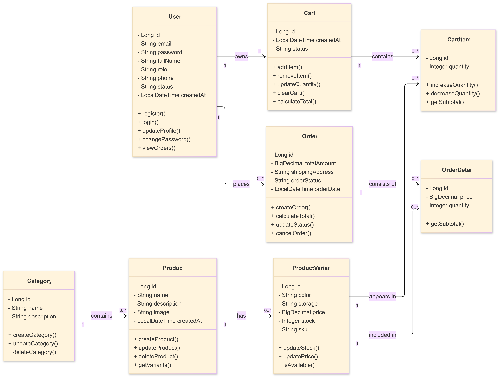

---

# 5. Thiết kế chi tiết

## 5.1 Module Quản lý người dùng

### 5.1.1 Tổng quan

Chức năng:

* Đăng ký tài khoản (role mặc định: CUSTOMER)
* Đăng nhập — hệ thống trả về JWT token
* Cập nhật thông tin cá nhân
* Phân quyền RBAC: ADMIN / CUSTOMER

### 5.1.2 Sequence – Đăng ký

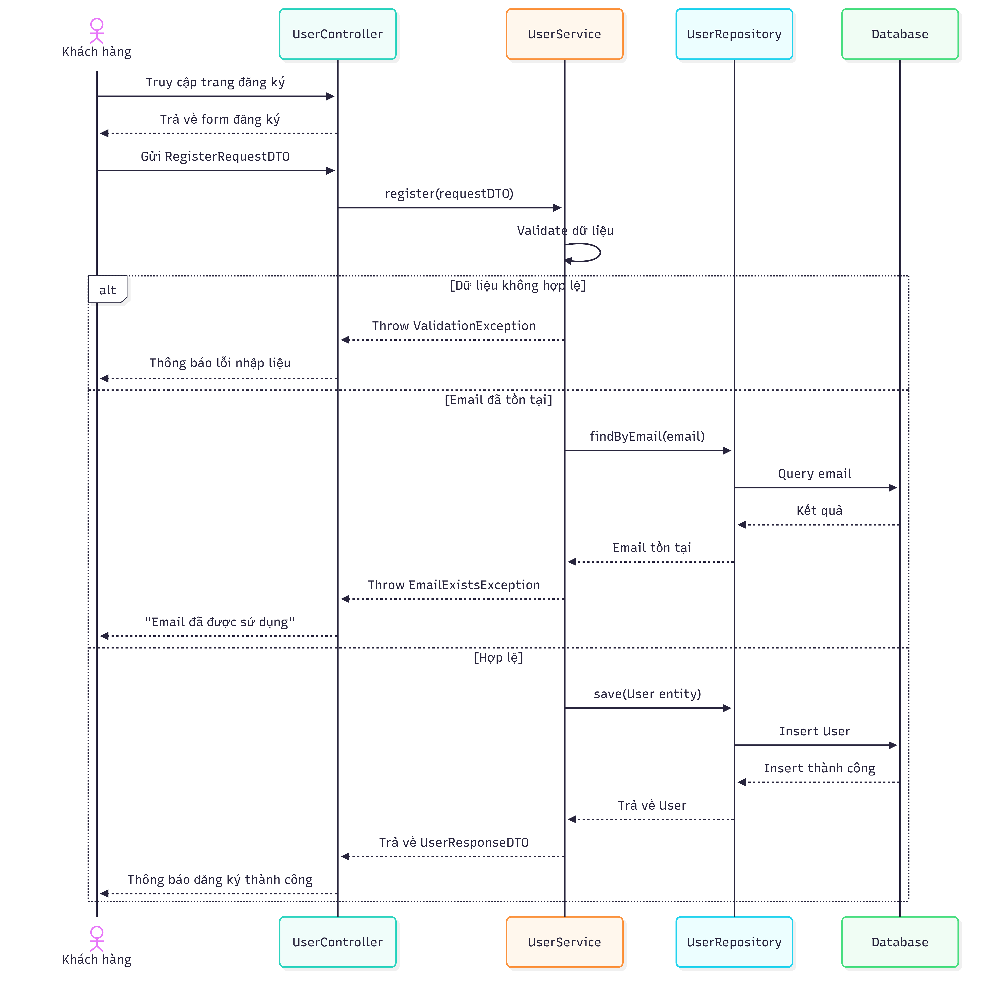

### 5.1.3 Sequence – Đăng nhập

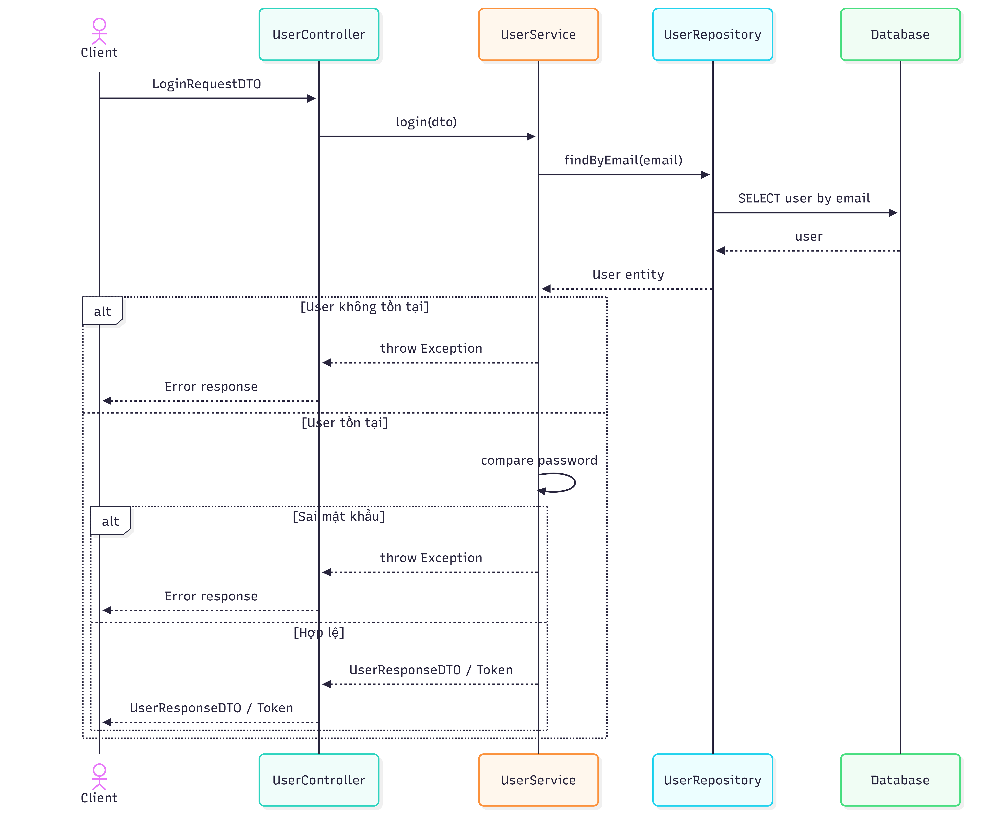

---

## 5.2 Module Xem và tìm kiếm sản phẩm

### 5.2.1 Tổng quan

Chức năng:

* Hiển thị danh sách sản phẩm (phân trang)
* Lọc theo danh mục, thương hiệu, khoảng giá, thuộc tính (RAM, Storage...)
* Tìm kiếm theo tên sản phẩm (không phân biệt hoa/thường)
* Xem chi tiết sản phẩm kèm biến thể, thông số kỹ thuật, đánh giá và sản phẩm liên quan

### 5.2.2 Sequence – Xem danh sách sản phẩm

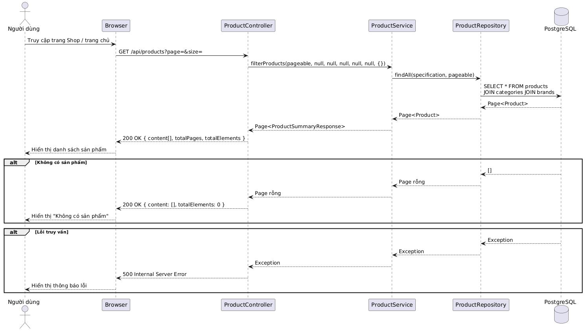

### 5.2.3 Sequence – Lọc sản phẩm

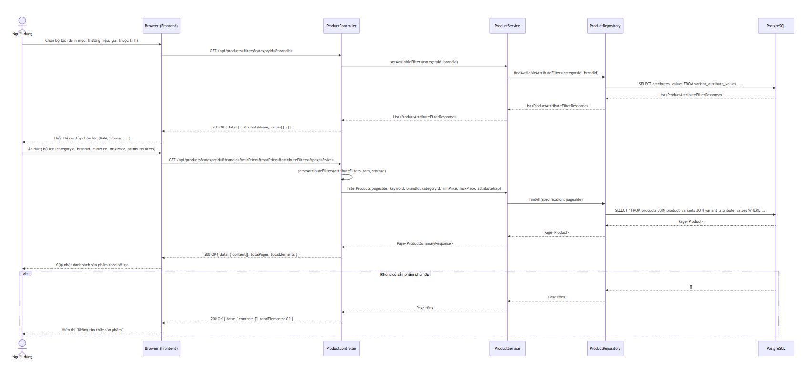

### 5.2.4 Sequence – Tìm kiếm sản phẩm

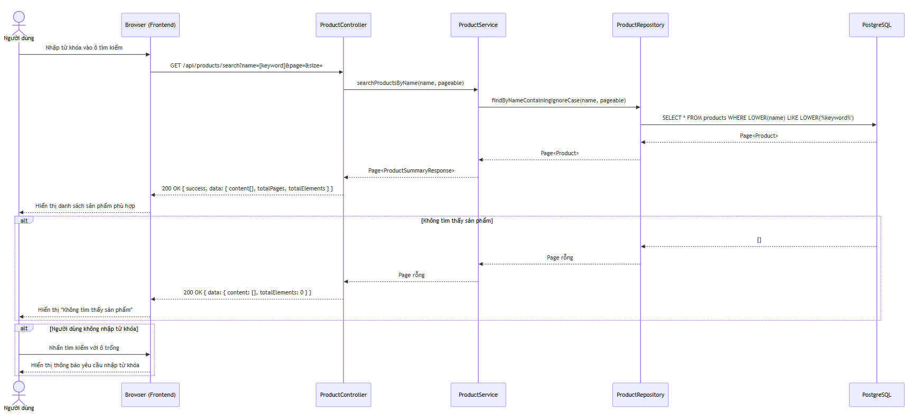

### 5.2.5 Sequence – Xem chi tiết sản phẩm

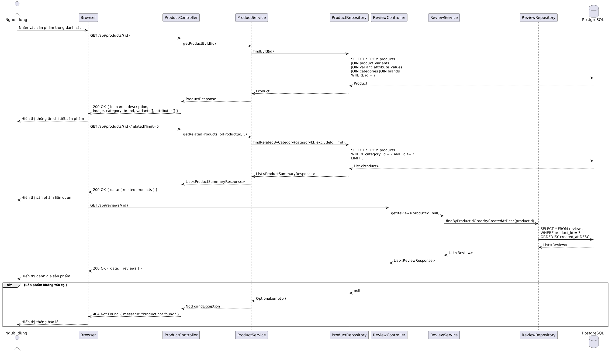

---

## 5.3 Module Quản lý đơn hàng

### 5.3.1 Tổng quan

Chức năng:

* Tạo đơn hàng từ giỏ hàng hoặc mua ngay (Buy Now)
* Áp dụng mã giảm giá (coupon) khi checkout
* Thanh toán COD hoặc QR qua PayOS
* Xem lịch sử đơn hàng
* Theo dõi và hủy đơn hàng

Trạng thái đơn hàng: `PENDING → CONFIRMED → PROCESSING → SHIPPING → DELIVERED` hoặc `CANCELLED / FAILED`

### 5.3.2 Sequence – Tạo đơn hàng

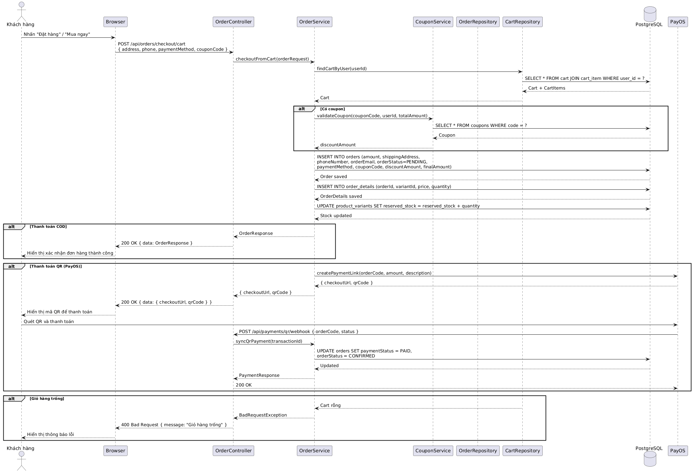

### 5.3.3 Sequence – Xem lịch sử đơn hàng

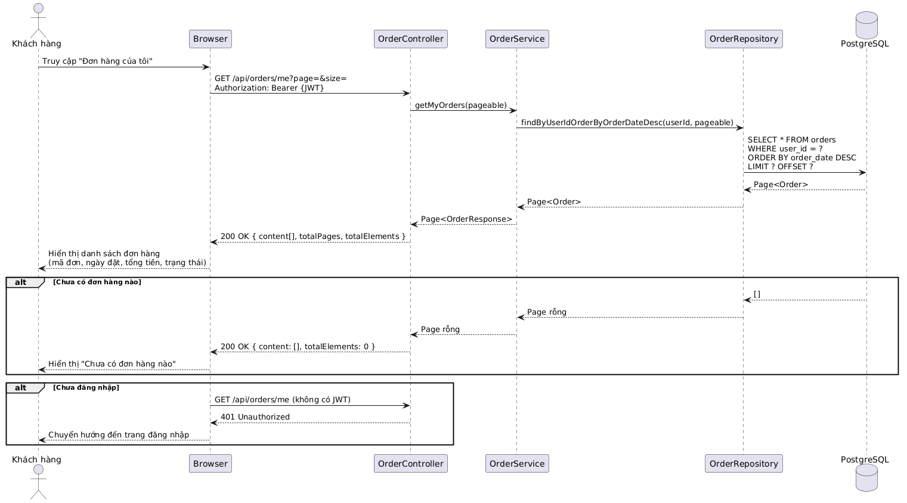

### 5.3.4 Sequence – Theo dõi trạng thái đơn hàng

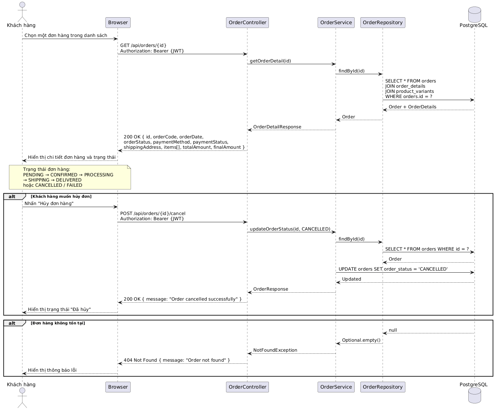

---

## 5.4 Module Quản lý giỏ hàng

### 5.4.1 Tổng quan

Chức năng:

* Thêm variant sản phẩm vào giỏ (yêu cầu đăng nhập)
* Cập nhật số lượng
* Xóa sản phẩm khỏi giỏ
* Mỗi user có đúng 1 giỏ hàng (quan hệ 1-1)

### 5.4.2 Sequence – Thêm vào giỏ hàng


### 5.4.3 Sequence – Cập nhật số lượng

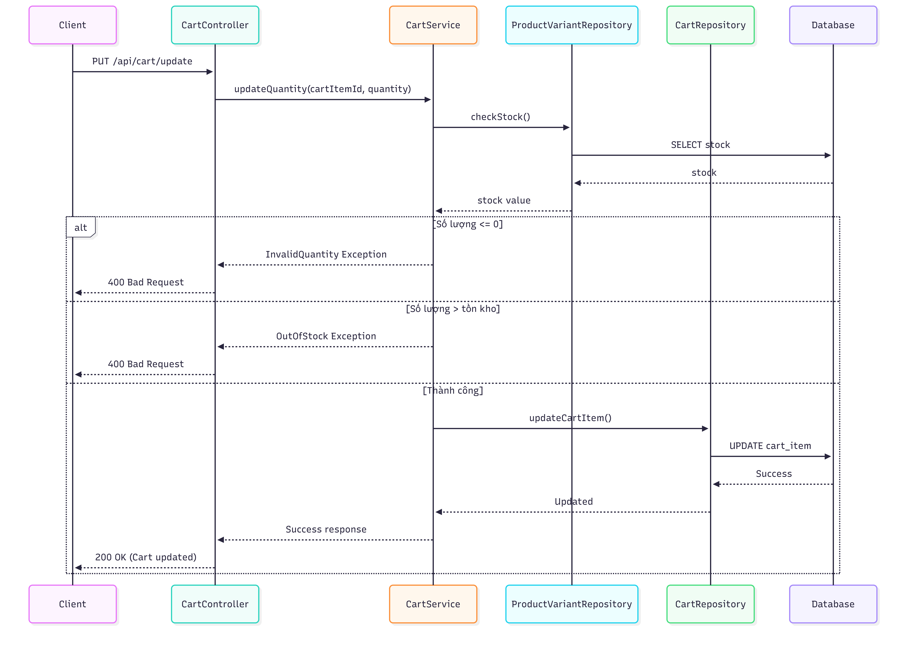

### 5.4.4 Sequence – Xóa sản phẩm khỏi giỏ hàng

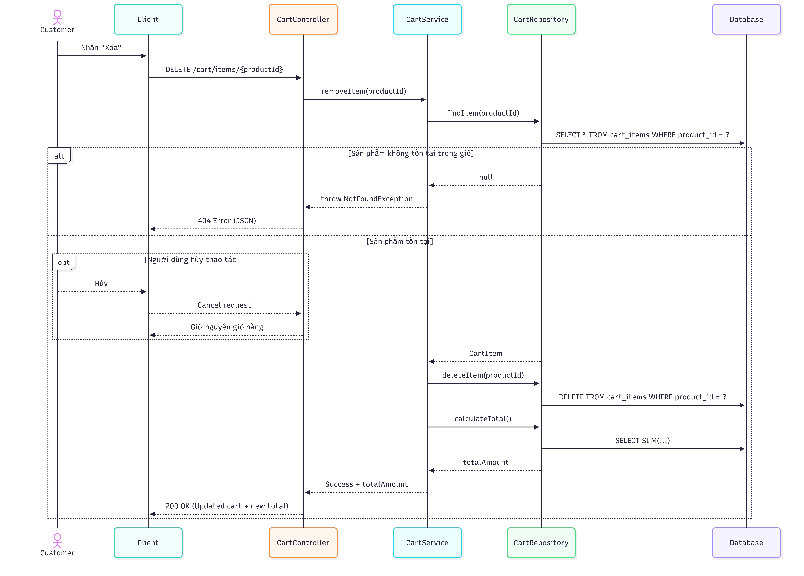

---

## 5.5 Module Quản lý hệ thống (Admin)

### 5.5.1 Tổng quan

Chức năng:

* CRUD sản phẩm (kèm upload ảnh)
* Quản lý biến thể (SKU, giá, tồn kho, thuộc tính)
* Quản lý danh mục, thương hiệu, thuộc tính
* Quản lý đơn hàng và cập nhật trạng thái
* Quản lý người dùng (xem, tìm kiếm, khóa/mở khóa)
* Quản lý mã giảm giá (PERCENT / FIXED, giới hạn sử dụng)
* Quản lý Promotion Popup

### 5.5.2 Sequence – Thêm sản phẩm

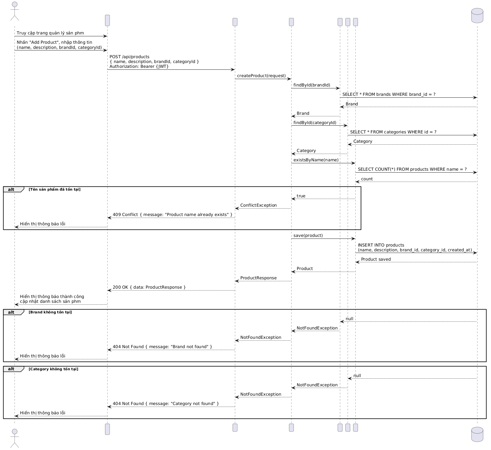

### 5.5.3 Sequence – Cập nhật thông tin sản phẩm

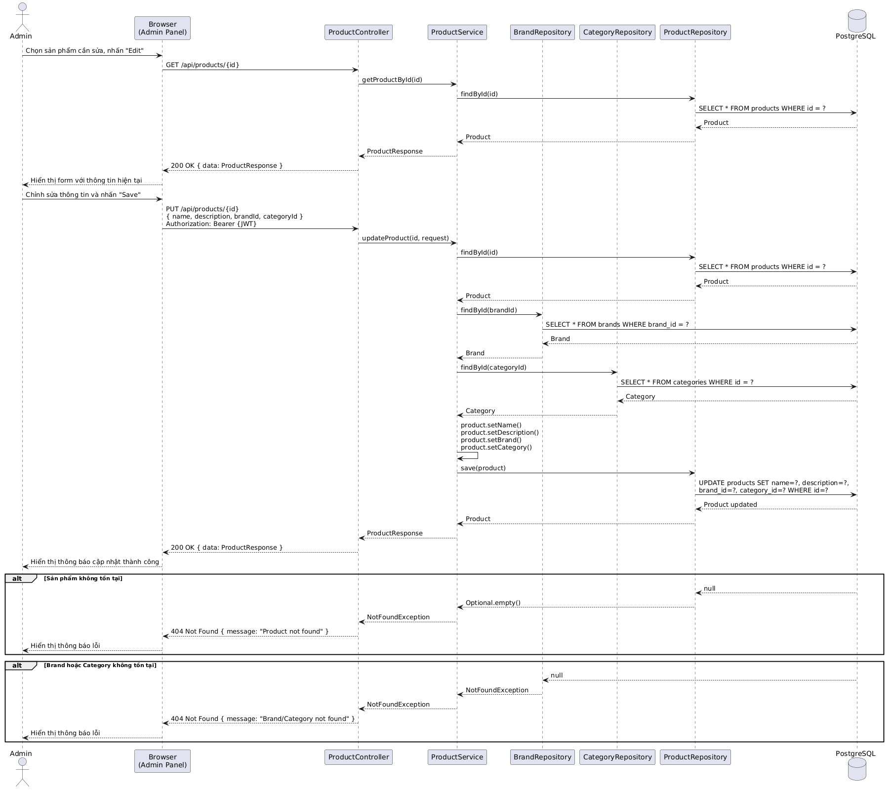

---

## 5.6 Module Đánh giá sản phẩm (Review)

### 5.6.1 Tổng quan

Chức năng:

* Xem danh sách đánh giá theo sản phẩm — công khai, không cần đăng nhập
* Lọc đánh giá theo số sao (1–5)
* Viết đánh giá mới — yêu cầu đăng nhập (CUSTOMER)
* Sửa đánh giá của chính mình
* Xóa đánh giá của chính mình; Admin xóa bất kỳ đánh giá nào

Luồng xem đánh giá được tích hợp trong sequence xem chi tiết sản phẩm (mục 5.2.5).


---

## 5.7 Module Promotion Popup

### 5.7.1 Tổng quan

Chức năng:

* Hiển thị popup khuyến mãi lần đầu tiên mỗi tab truy cập trang chủ
* Admin quản lý popup: thêm, sửa, xóa, bật/tắt
* Popup có thể liên kết đến sản phẩm cụ thể hoặc trang shop
* Hỗ trợ gắn mã coupon vào popup

### 5.7.2 Logic hiển thị

* Dùng `sessionStorage` để kiểm soát: mỗi tab chỉ hiển thị popup một lần duy nhất
* Hệ thống gọi `GET /api/public/popups/active` để lấy popup đang active
* Popup active là popup có `is_active = true` và thời điểm hiện tại nằm trong khoảng `start_date` – `end_date`

---

**Ghi chú:** Các file ảnh sequence diagram được lưu trong thư mục `docs/images/`.
