# Hướng dẫn sử dụng TechGadget

## Giới thiệu

Tài liệu này hướng dẫn chi tiết cho:

- **Khách hàng**: tìm kiếm, chọn sản phẩm, thêm giỏ, thanh toán, theo dõi trạng thái đơn
- **Admin**: đăng nhập quản trị, quản lý sản phẩm, đơn hàng, khách hàng, giảm giá và popup

---

## 1. Luồng hoạt động tổng quan

### 1.1 Luồng khách hàng

1. Mở trang chủ `Home`
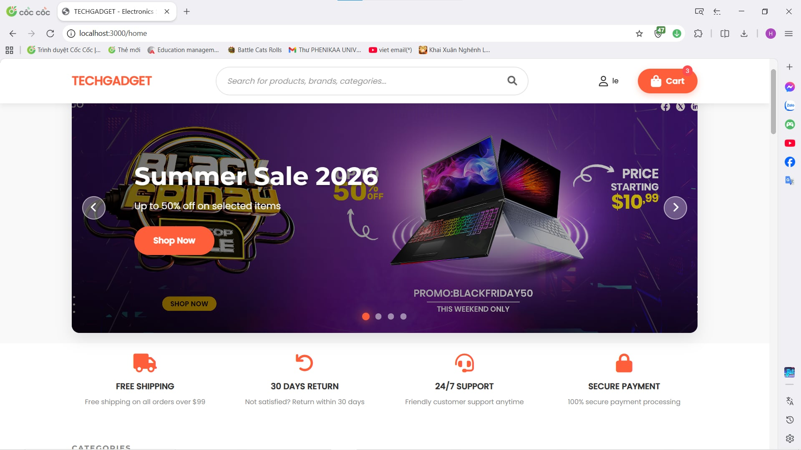
2. Duyệt danh mục hoặc sản phẩm nổi bật
3. Tìm kiếm bằng thanh search trên header
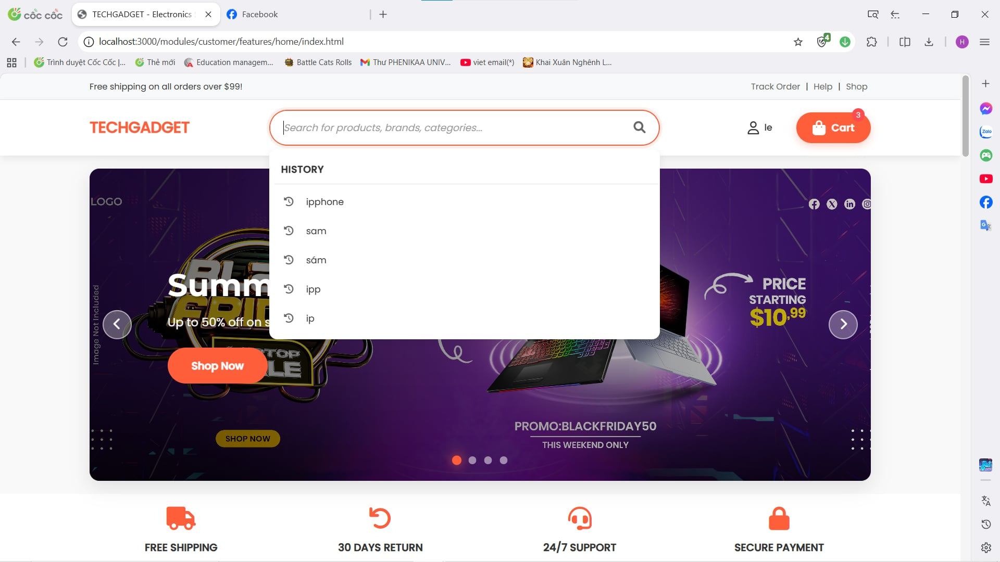
4. Vào trang chi tiết sản phẩm
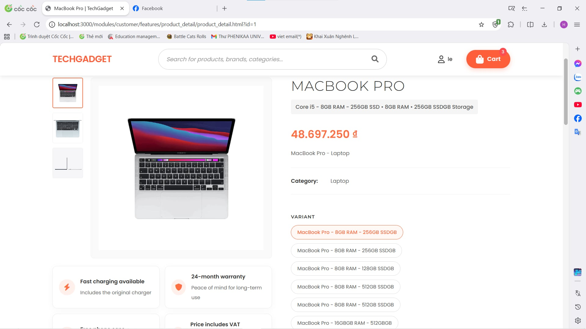
5. Chọn variant (màu, RAM, dung lượng,...) và số lượng
6. Nhấn `Add to Cart` để thêm giỏ
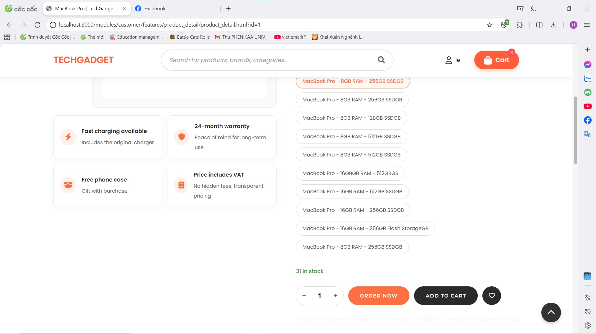
7. Hoặc nhấn `Buy Now` để mua ngay, chuyển thẳng tới `Checkout`
8. Vào `Cart` để điều chỉnh số lượng hoặc xóa sản phẩm
9. Đặt hàng tại `Checkout` và cung cấp thông tin giao nhận
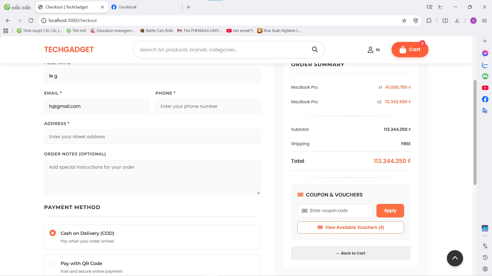
10. Xem đơn hàng trong `Account` nếu đã đăng nhập
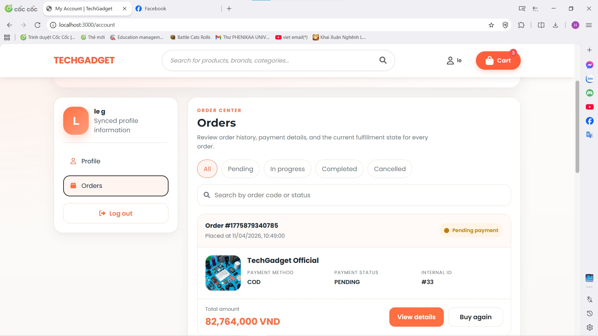
### 1.2 Luồng admin

1. Truy cập trang quản trị `/admin/login`
2. Đăng nhập với tài khoản admin
3. Chuyển đến `Dashboard` để xem tổng quan
4. Duyệt thanh điều hướng bên trái để vào:
   - `Categories`
   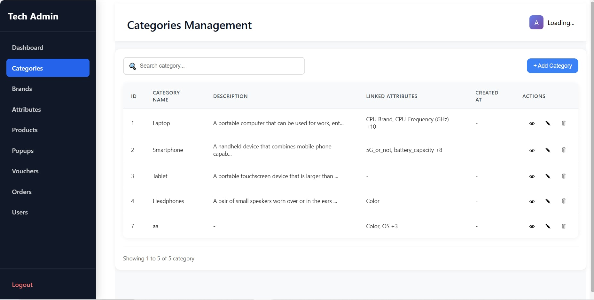
   - `Brands`
   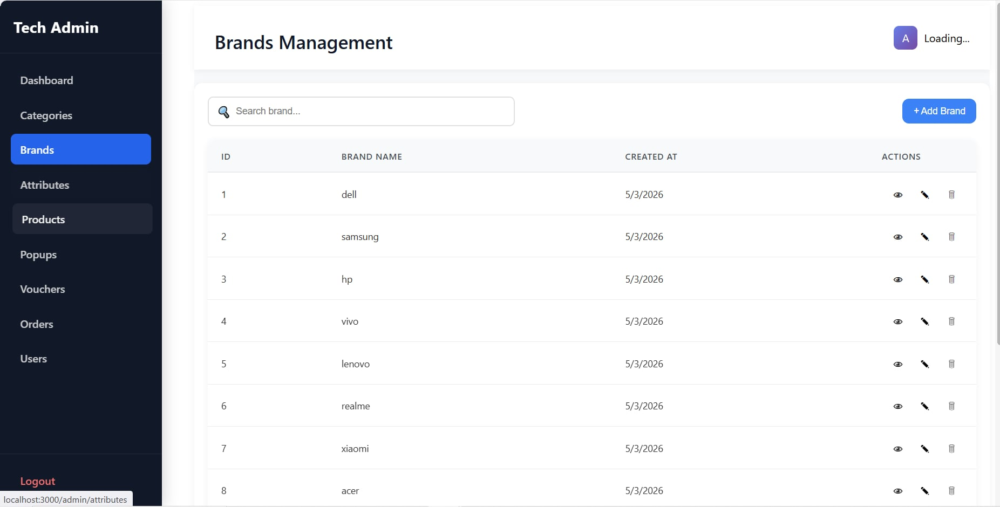
   - `Attributes`
   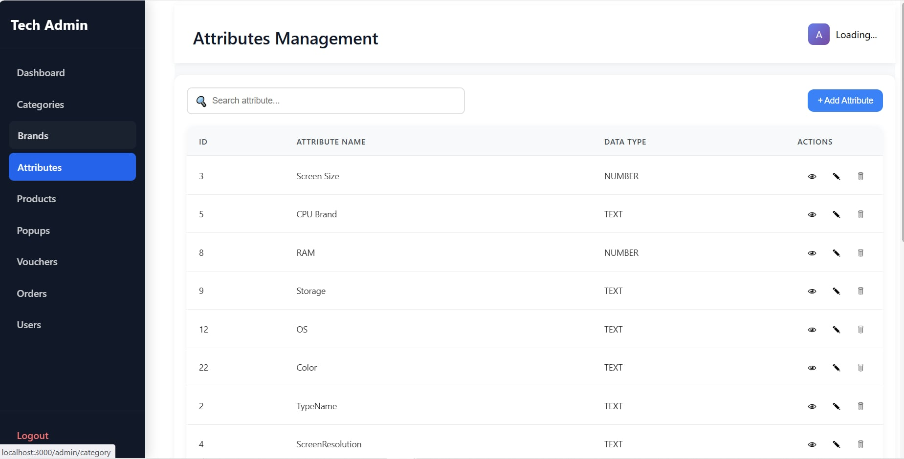
   - `Products`
   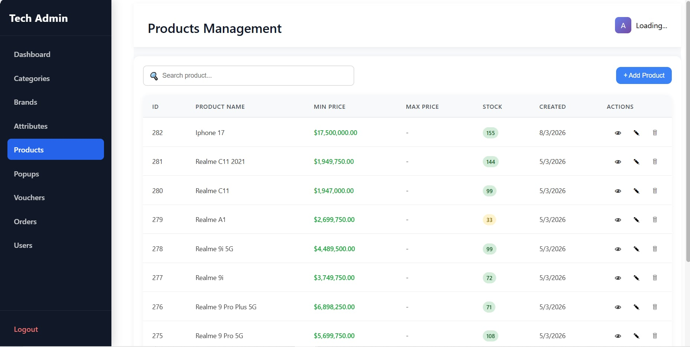
   - `Popups`
   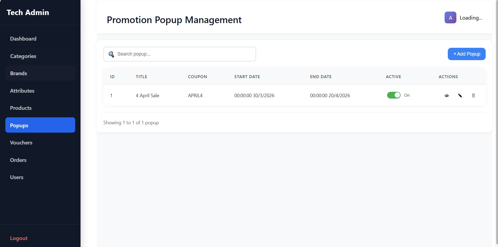
   - `Discounts`
   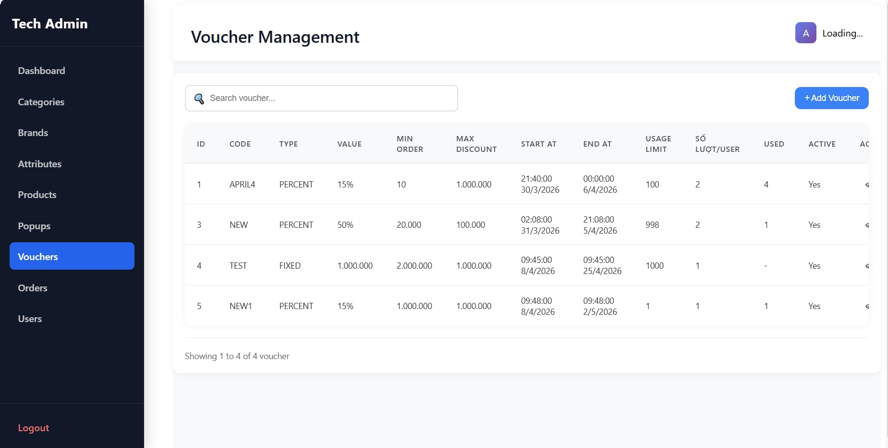
   - `Orders`
   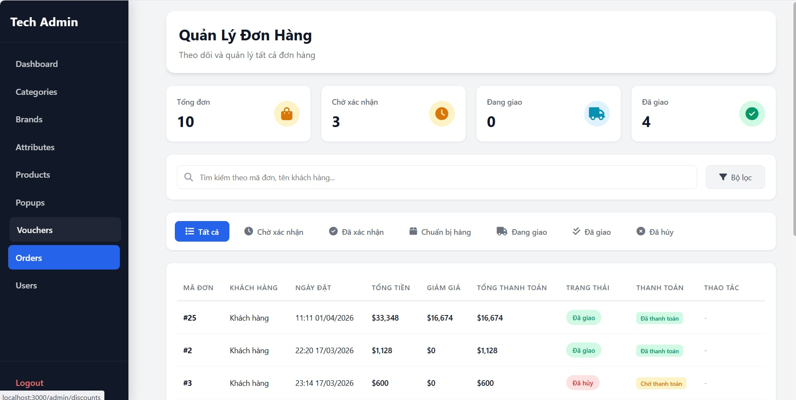
   - `Users`
   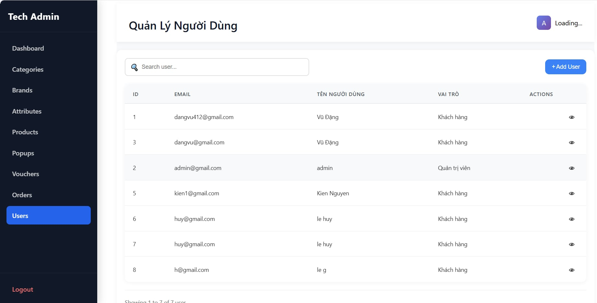
5. Xem và cập nhật trạng thái đơn hàng
6. Quản lý sản phẩm, danh mục, thiết lập khuyến mãi và popup

---

## 2. Luồng khách hàng chi tiết

### 2.1 Truy cập và điều hướng

- Trang chủ của khách hàng thường bắt đầu ở `/home`
- Header có:
  - thanh tìm kiếm thông minh
  - link `Account`/`Login`
  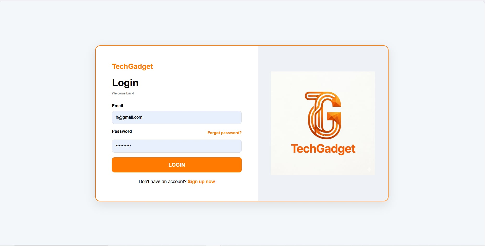
  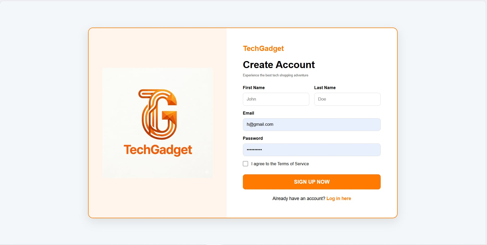
  - biểu tượng giỏ hàng
- Menu và trang `Shop` cho phép duyệt theo danh mục, thương hiệu và bộ lọc
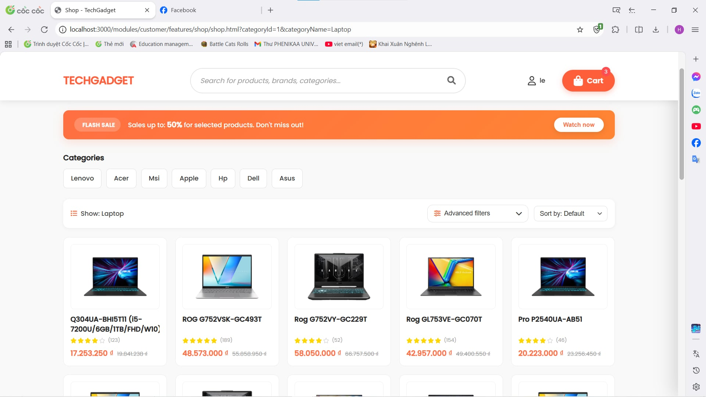

### 2.2 Tìm kiếm và gợi ý

- Khi nhập từ khóa, hệ thống gợi ý và hiển thị sản phẩm
- Thanh search sử dụng `productApi.searchSuggestions()` để trả về sản phẩm gợi ý
- Nếu chọn gợi ý, người dùng được chuyển tới trang chi tiết sản phẩm
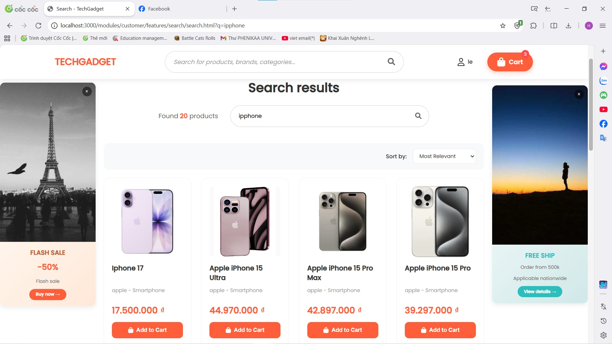
- Nếu submit form tìm kiếm, hệ thống chuyển tới trang `Search` với parameter `q`

### 2.3 Xem chi tiết sản phẩm

Trang chi tiết sản phẩm bao gồm:

- Tên sản phẩm, breadcrumb, đánh giá sao giả lập
- Mô tả chi tiết và thông tin kỹ thuật
- Ảnh gallery và thumbnails
- Biến thể sản phẩm:
  - smartphone có Group màu/RAM
  - sản phẩm khác hiển thị variant bình thường
- Giá và tồn kho theo variant
- Nút `Add to Cart` và `Buy Now`

- Tab nội dung: `Description`, `Information`, `Reviews`

### 2.4 Thêm vào giỏ hàng

Khi nhấn `Add to Cart`:

- Nếu chưa đăng nhập, hệ thống ghi nhớ URL hiện tại và hiển thị modal yêu cầu login
- Nếu đã đăng nhập, hệ thống gọi `cartAPI.addToCart(variantId, quantity)`
- Sau khi thêm, thông báo `Item added to cart.` và cập nhật số lượng giỏ hàng ở header

### 2.5 Mua ngay (Buy Now)

Khi nhấn `Buy Now`:

- Hệ thống kiểm tra login
- Nếu chưa login, yêu cầu login trước
- Nếu đã login, lưu tạm `sessionStorage.BUY_NOW_KEY` với thông tin sản phẩm và chuyển tới `/checkout?mode=buy-now`

- Trang `Checkout` sẽ chỉ hiển thị sản phẩm đó và không dùng giỏ hàng chung

### 2.6 Quản lý giỏ hàng (Cart)

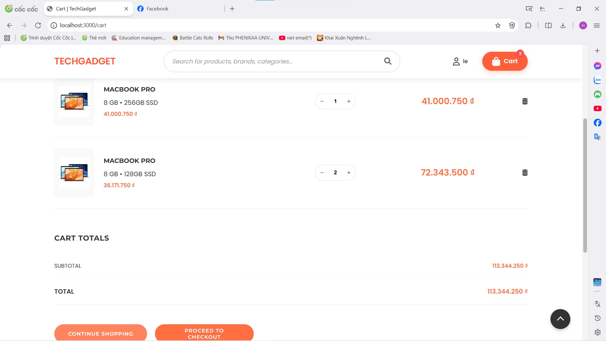

Trang `Cart` có các chức năng:

- Hiển thị danh sách sản phẩm trong giỏ
- Thay đổi số lượng bằng nút `-` / `+`
- Xóa hàng với confirm modal
- Nút `Continue shopping` quay về `Home`
- Nút `Checkout` dẫn tới trang thanh toán

Hành vi chi tiết:

- Nếu chưa đăng nhập, hiển thị modal yêu cầu login
- Khi tăng/giảm số lượng, gọi `cartAPI.updateQuantity()`
- Khi xóa sản phẩm, gọi `cartAPI.removeItem()`
- Tổng tiền và subtotal cập nhật tự động

### 2.7 Thanh toán (Checkout)

Trang `Checkout` hỗ trợ:

- Chế độ `cart` (mua từ giỏ hàng) hoặc `buy-now`
- Hiển thị `order summary` gồm tên sản phẩm, biến thể, số lượng, giá
- Tính subtotal, phí ship và giảm giá
- Mã giảm giá và coupon có thể áp dụng
- Nếu đơn hàng trên 99 (đơn vị nội bộ), phí vận chuyển là miễn phí

Thông tin cần điền:

- Họ tên
- Email
- Số điện thoại
- Địa chỉ giao hàng
- Phương thức thanh toán

Quy trình đặt hàng:

1. Kiểm tra dữ liệu form
2. Tạo `orderRequest` gồm `shippingAddress`, `phoneNumber`, `orderEmail`, `paymentMethod`, `items`, `couponCode`.
3. Nếu chọn thanh toán `QR`, hệ thống gọi API và chuyển tới URL QR.
4. Ngược lại, gửi đơn qua `checkoutAPI.checkoutBuyNow()` hoặc `checkoutAPI.checkoutFromCart()`.
5. Xóa session `cart` và `BUY_NOW_KEY`, cập nhật header giỏ hàng
6. Chuyển về `/home` sau khi đặt thành công

Thông báo lỗi:

- Nếu form chưa hoàn chỉnh: yêu cầu điền đầy đủ
- Nếu không tải được giỏ hàng: chuyển về `/cart`
- Nếu QR hoặc đặt hàng thất bại: hiển thị lỗi và không chuyển tiếp

### 2.8 Theo dõi đơn hàng

- Khách hàng đã đăng nhập có thể vào trang `Account`
- Trang `Account` hiển thị danh sách đơn hàng của user
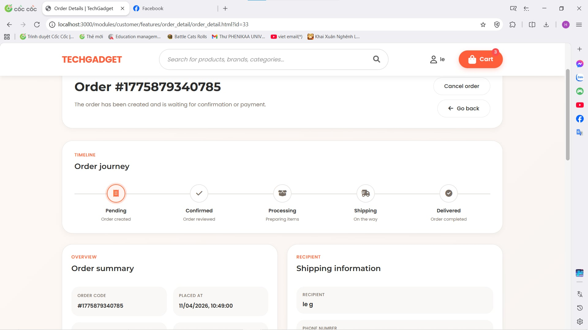
- Mỗi đơn hàng có link để xem chi tiết trạng thái
- Nếu chưa đăng nhập, hệ thống yêu cầu login trước khi xem chi tiết

---

## 3. Luồng admin chi tiết

### 3.1 Đăng nhập admin

- Truy cập `/admin/login`
- Nhập email và mật khẩu
- Nếu thông tin đúng, chuyển về trang `Dashboard`
- Nếu chưa login, mọi trang admin đều sử dụng `checkAdmin()` để điều hướng về login

### 3.2 Dashboard

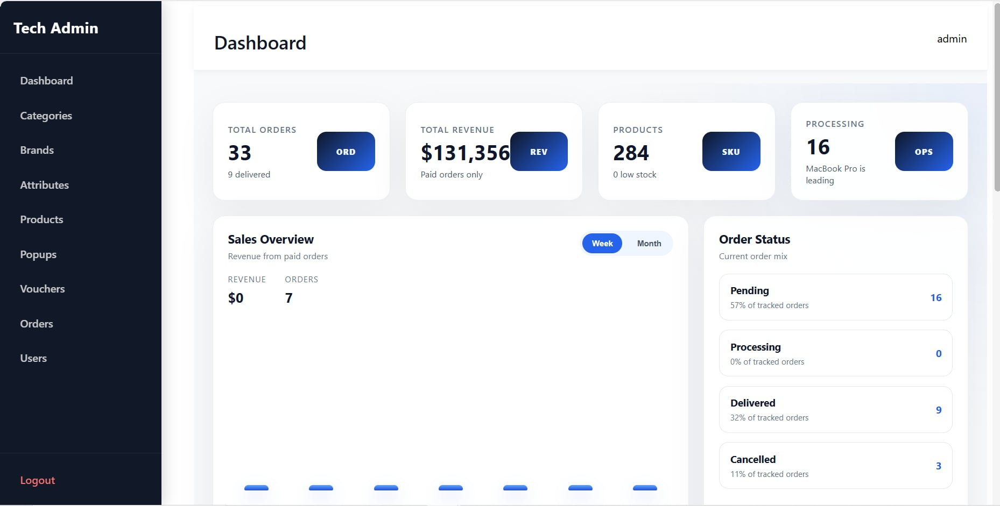

Trang `Dashboard` hiển thị:

- Tổng đơn hàng (`Total Orders`)
- Doanh thu thực tế (`Revenue`)
- Số đơn hàng đang xử lý (`Processing`)
- Số đơn đã giao (`Delivered`)
- Biểu đồ doanh số theo `week`, `month`, `year`
- Thống kê tình trạng đơn hàng: `Pending`, `Processing`, `Delivered`, `Cancelled`
- Danh sách đơn hàng mới kèm trạng thái

### 3.3 Quản lý danh mục và thương hiệu

- Vào `Categories` để xem, thêm, sửa, xóa nhóm sản phẩm

- Vào `Brands` để quản lý thương hiệu

- Vào `Attributes` để thêm các thuộc tính sản phẩm như màu, dung lượng, RAM

### 3.4 Quản lý sản phẩm

- Vào `Products`
- Xem danh sách sản phẩm.
- Thêm mới sản phẩm với:
  - Tên, mô tả
  - Danh mục, thương hiệu
  - Ảnh, giá, tồn kho
  - Variant và thuộc tính
- Sửa hoặc xóa sản phẩm hiện tại

### 3.5 Quản lý khuyến mãi

- Vào `Discounts` để tạo mã giảm giá
- Thay đổi mức chiết khấu và thời gian áp dụng
- Bật/tắt mã coupon khi cần

### 3.6 Quản lý popup

- Vào `Popups` để tạo nội dung hiển thị trên frontend
- Popup có thể dùng cho thông báo, ưu đãi, banner quảng cáo
- Quản lý trạng thái hiển thị

### 3.7 Quản lý đơn hàng

Trang `Orders` cho phép:

- Lọc theo trạng thái: `all`, `pending`, `confirmed`, `processing`, `shipping`, `delivered`, `cancelled`
- Tìm kiếm đơn hàng
- Xem thông tin đơn hàng:
  - Mã đơn
  - Tên khách
  - Ngày đặt
  - Tổng tiền
  - Trạng thái thanh toán
  - Trạng thái giao hàng
- Cập nhật trạng thái chờ xử lý qua modal

Luồng trạng thái đơn hàng:

- `PENDING` → `CONFIRMED` hoặc `CANCELLED`
- `CONFIRMED` → `PROCESSING` hoặc `CANCELLED`
- `PROCESSING` → `SHIPPING` hoặc `CANCELLED`
- `SHIPPING` → `DELIVERED`

### 3.8 Quản lý người dùng

- Vào `Users` để xem danh sách khách hàng
- Kiểm tra thông tin liên hệ và trạng thái tài khoản
- Nếu cần, quản lý quyền hoặc xóa tài khoản

---

## 4. Luồng hành trình chính

### 4.1 Khách hàng

Home → Search → Product Detail → Add to Cart / Buy Now → Cart → Checkout → Order placed → Account → Order detail

### 4.2 Admin

Admin Login → Dashboard → Orders → Open order → Update status → Products / Discounts / Popups → Reports

---

## 5. Thông tin trang và đường dẫn chính

### Đường dẫn khách hàng

- `/home` - Trang chủ
- `/shop` - Trang cửa hàng
- `/login` - Đăng nhập khách hàng
- `/checkout` - Thanh toán giỏ hàng
- `/checkout?mode=buy-now` - Thanh toán nhanh
- `/account` - Trang tài khoản
- `/products/:id` hoặc `product_detail.html?id=` - Trang chi tiết sản phẩm

### Đường dẫn admin

- `/admin/login` - Đăng nhập admin
- `/admin/dashboard` - Dashboard
- `/admin/category` - Quản lý danh mục
- `/admin/brand` - Quản lý thương hiệu
- `/admin/attribute` - Quản lý thuộc tính
- `/admin/product` - Quản lý sản phẩm
- `/admin/popup` - Quản lý popup
- `/admin/discount` - Quản lý mã giảm giá
- `/admin/order` - Danh sách đơn hàng
- `/admin/user` - Danh sách người dùng

---

## 6. Ghi chú kỹ thuật

- Frontend chính: `client/`.
- Admin module: `client/modules/admin/`.
- Khách hàng module: `client/modules/customer/`.
- Shared helper: `client/shared/`.
- Backend: `server/` (Spring Boot, Maven).
- API tương tác qua các file `client/modules/*/core/api/*.js`.

